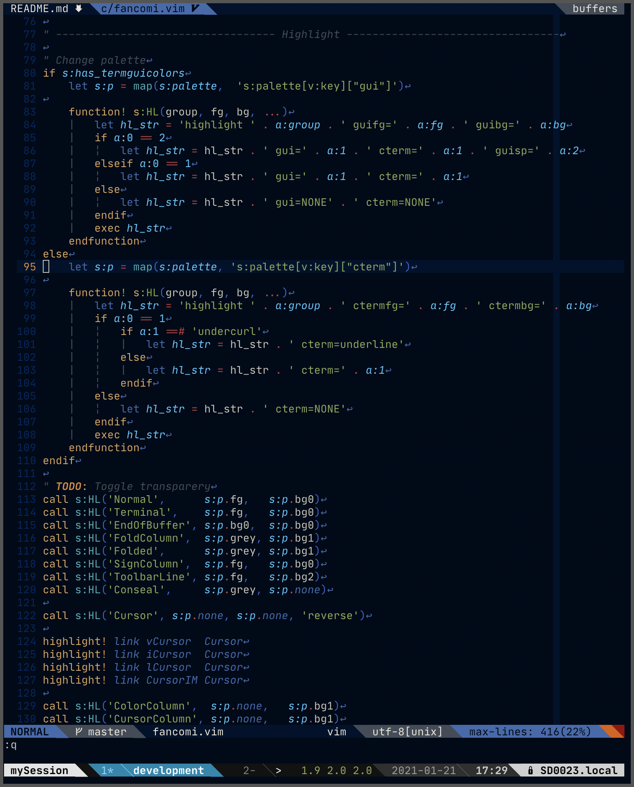
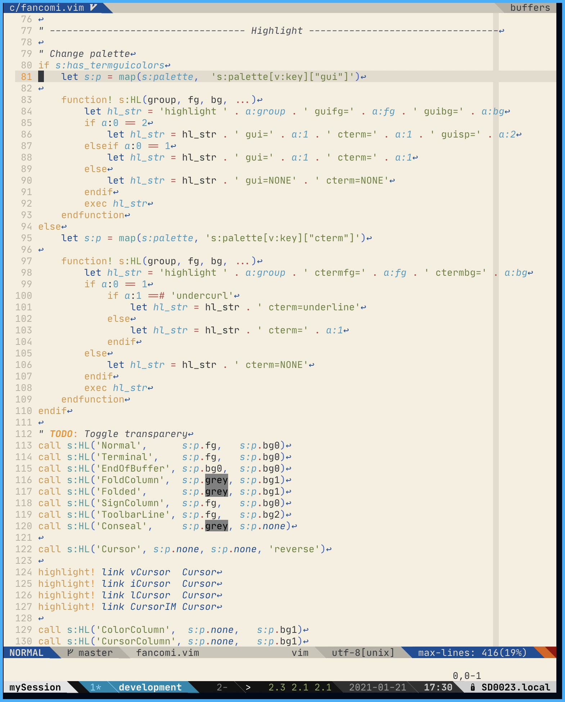

## fancomi-vim

colorscheme where inspired the logo of [fancommunications, inc](https://www.fancs.com/).

- blue color base
- true color support

|          Dark           |          Light           |
| :---------------------: | :----------------------: |
|  |  |

### Installlation

#### 1. install plugin

##### dein.vim

vimscript

```vim
call dein#add('nnsnico/fancomi-vim-private')
```

toml

```toml
[[plugins]]
repo = 'nnsnico/fancomi-vim-private'
```

#### 2. set colorscheme

```vim
set background=dark " able to select dark or light
colorscheme fancomi
```

### Support languages

- Scala
- Vim script
- HTML
- Markdown

### Support plugins

- [vim-airline/vim-airline](https://github.com/vim-airline/vim-airline)
- [airblade/gitgutter](https://github.com/airblade/vim-gitgutter)
- [preservim/nerdtree](https://github.com/preservim/nerdtree)
- [neoclide/coc.nvim](https://github.com/neoclide/coc.nvim)
- [easymotion/vim-easymotion](https://github.com/easymotion/vim-easymotion)
- [mg979/vim-visual-multi](https://github.com/mg979/vim-visual-multi)
- [Yggdroot/indentLine](https://github.com/Yggdroot/indentLine)
